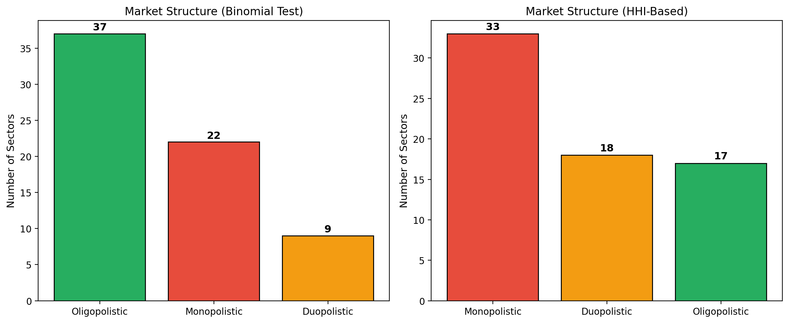
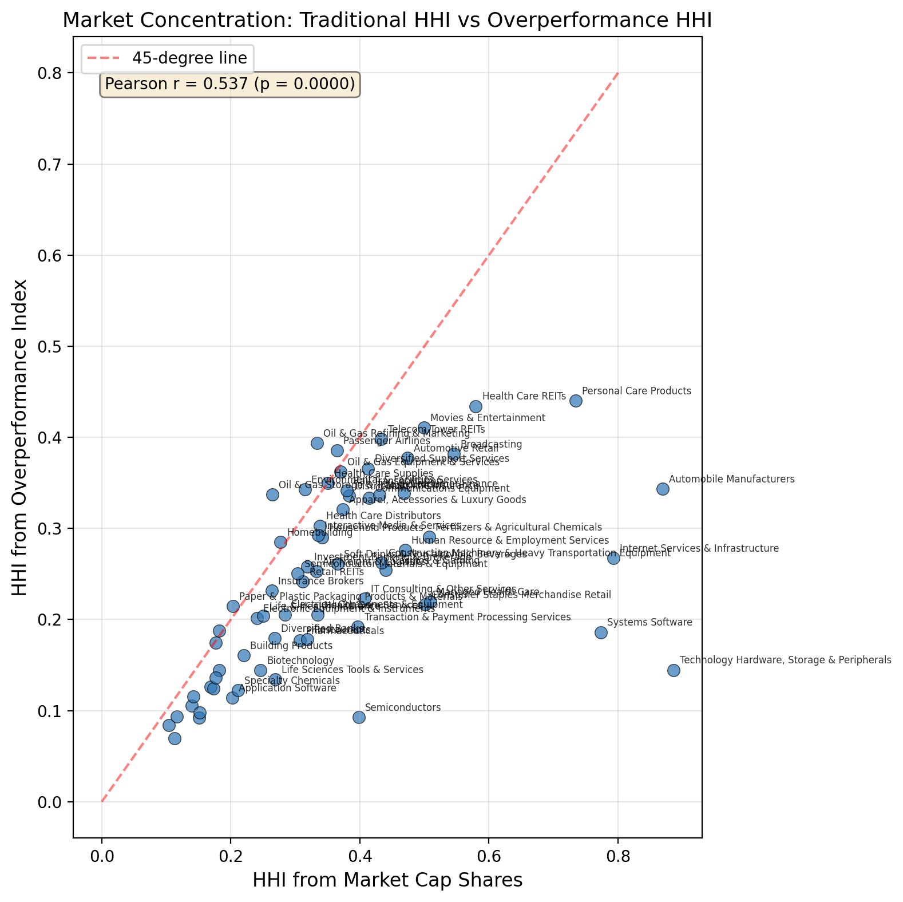
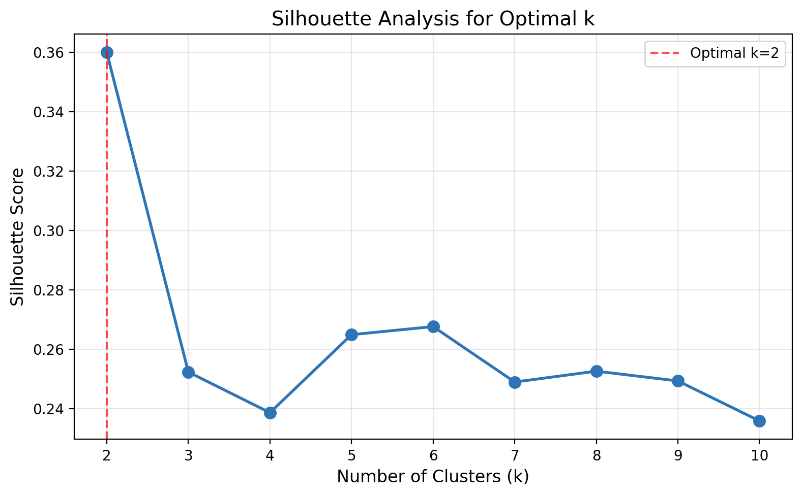
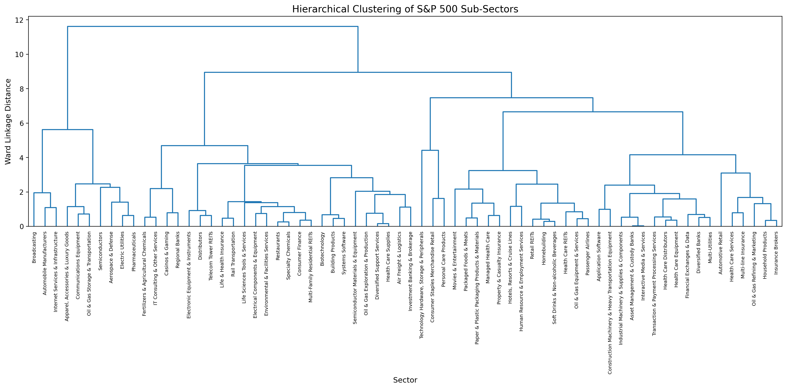
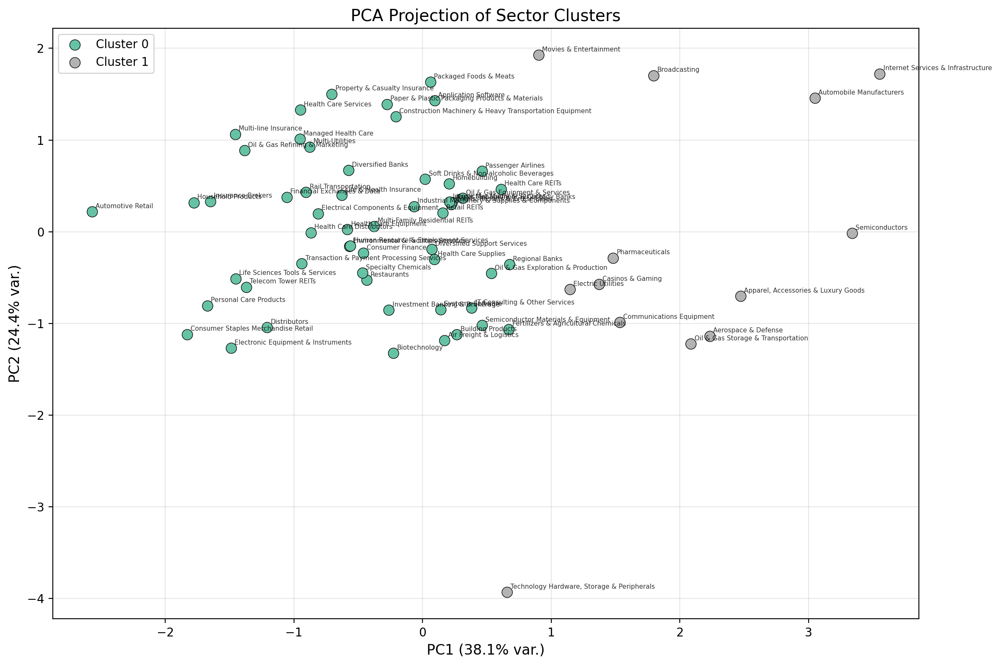
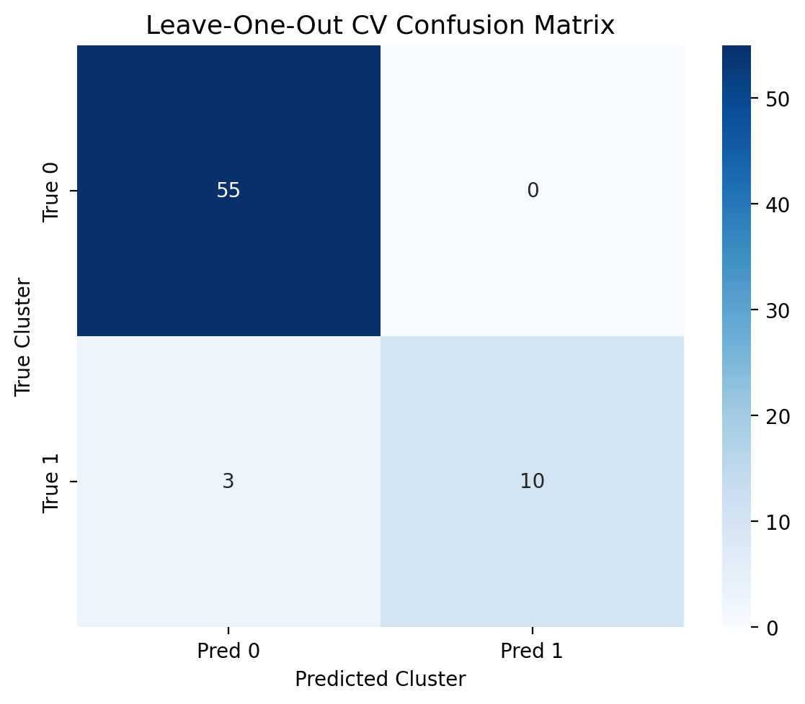
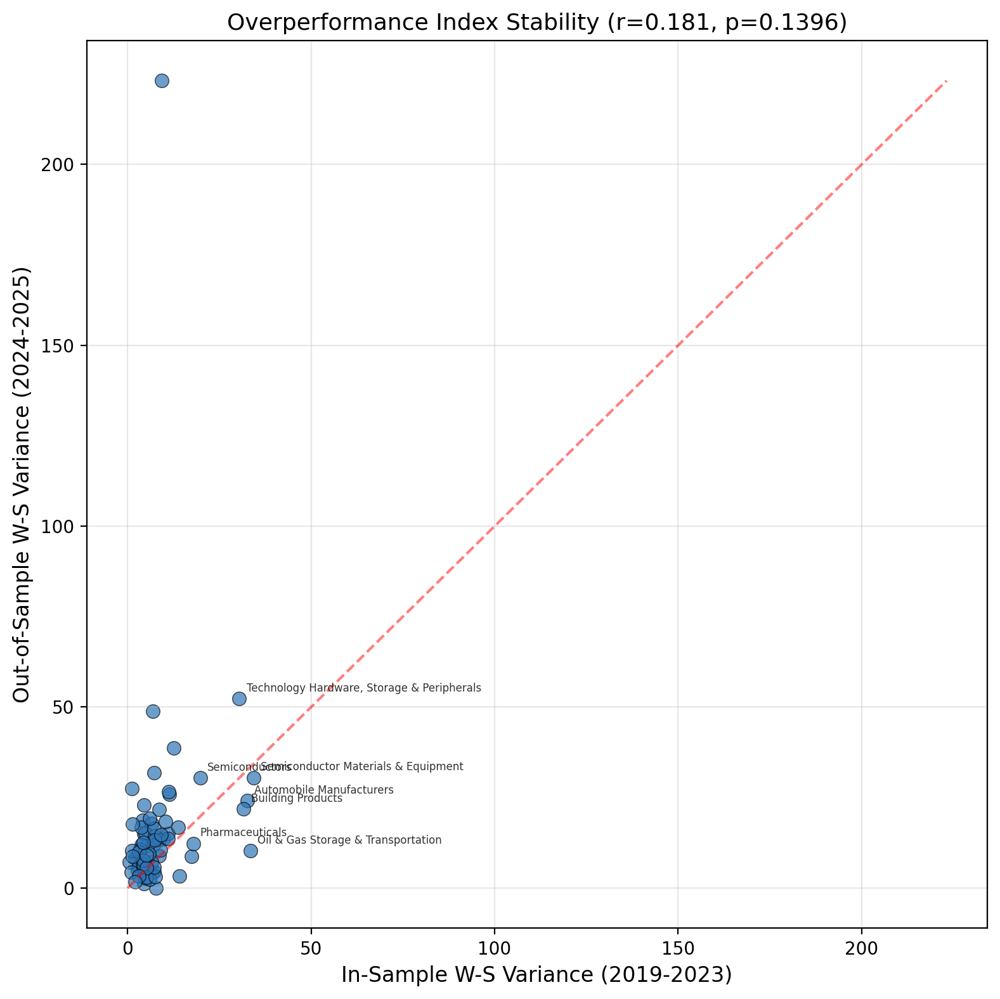
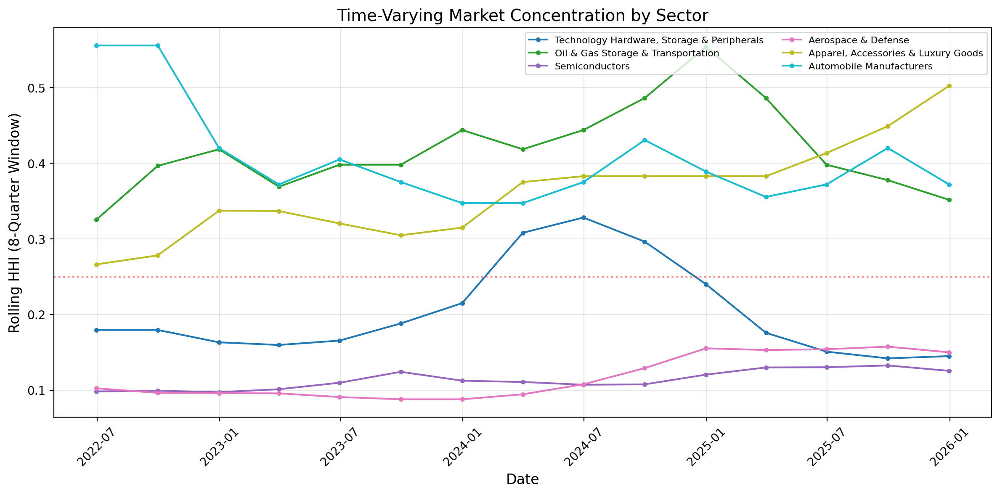
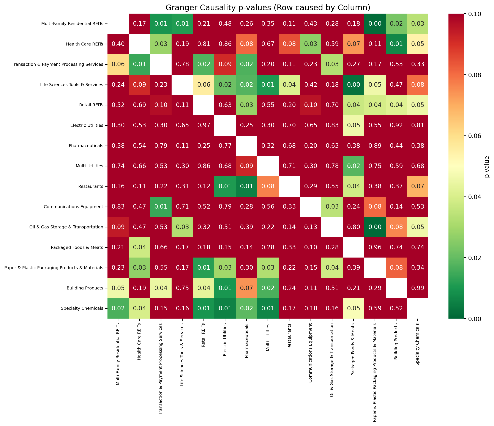

# Sector-Level Analysis and Clustering of S&P 500 Companies Using Financial Metrics and Machine Learning

**Author:** Tanishk Yadav | NYU Tandon School of Engineering
**ORCID:** [0009-0006-2382-9411](https://orcid.org/0009-0006-2382-9411)

---

## Key Results

| Metric | Value |
|---|---|
| Sectors analyzed | 68 |
| Companies covered | 400+ |
| Data range | Sep 2019 – Dec 2025 |
| Optimal clusters | 2 |
| LOO-CV Accuracy | 95.6% |
| Adjusted Rand Index | 0.791 |
| Fowlkes-Mallows Index | 0.941 |
| HHI Correlation | 0.537 |
| IS/OOS Structure Agreement | 75.0% |
| IS/OOS Growth Dominance *r* | 0.181 |
| Granger-causal pairs (*p* < 0.05) | 297 |

---

## Abstract

This paper presents a comprehensive analysis of sector-level competitive dynamics within the S&P 500 index, combining financial metrics, statistical testing, and unsupervised learning. We analyze 68 sub-sectors encompassing over 400 companies using five normalized parameters: year-over-year market capitalization growth, revenue growth, a novel squared-weight overperformance index, and short- and long-term beta covariances, with data spanning September 2019 through December 2025 (26 quarters). Market structures are classified as monopolistic, duopolistic, or oligopolistic using both binomial significance tests on outperformance counts and the Herfindahl-Hirschman Index (HHI), with strong agreement between methods (Pearson *r* = 0.537, *p* < 10⁻⁴). Hierarchical and K-Means clustering identifies 2 statistically optimal sector groups, validated through leave-one-out cross-validation with a Random Forest classifier achieving 95.6% accuracy and Fowlkes-Mallows index of 0.941. Temporal out-of-sample validation (training on 2019–2023, testing on 2024–2025) shows that 75% of sectors maintain their market structure classification, while overperformance rankings show significant reshuffling (*r* = 0.181, *p* = 0.14), indicating that market dominance is not persistent. Granger causality tests uncover 297 significant lead-lag relationships between sectors, providing evidence of cross-sector information transmission. These findings carry implications for portfolio construction, sector rotation strategies, and regulatory policy.

**Keywords:** S&P 500, Financial Metrics, Clustering, Herfindahl-Hirschman Index, Overperformance Index, Granger Causality, Market Structure, Sector Analysis

---

## 1. Introduction

Understanding competitive dynamics within stock market sectors is fundamental to investment strategy and regulatory policy [1, 2]. While individual stock analysis is well-studied, the sector-level perspective reveals structural patterns that are invisible at the company level: whether an industry is dominated by one firm, shared between two, or dispersed across many competitors.

Traditional industrial organization uses the Herfindahl-Hirschman Index (HHI) to measure market concentration based on revenue or market share [3]. However, static concentration metrics may not capture dynamic competitive advantages. A firm can dominate its sector's *growth* even if its absolute market share is moderate. This paper introduces an "overperformance index" that uses a squared-weight allocation to capture growth-based dominance, and validates it against the traditional HHI framework.

The analysis covers 68 GICS sub-sectors of the S&P 500 index with quarterly market capitalization data spanning September 2019 to December 2025 (26 quarters), and quarterly revenue data for the same period. Five normalized parameters are computed per sector and used for unsupervised clustering. The methodology extends prior work in four key dimensions:

1. **Statistical rigor**: Market structure classifications are supported by binomial significance tests, not arbitrary thresholds, with cross-validation through HHI comparison.
2. **Temporal out-of-sample validation**: An in-sample (2019–2023) / out-of-sample (2024–2025) split tests whether market structures and concentration rankings persist beyond the training window.
3. **Time-varying analysis**: Rolling-window overperformance concentration shows how market structures evolve across market cycles, rather than treating them as static.
4. **Inter-sector dependencies**: Granger causality tests on sector-level returns reveal directional lead-lag relationships, providing evidence of cross-sector information transmission that is relevant for sector rotation strategies.

---

## 2. Related Work

The application of clustering techniques to financial data has a rich history. Mantegna [9] introduced hierarchical clustering of stocks based on return correlations, establishing the concept of market taxonomy. Tumminello et al. [10] extended this to analyze the dynamic evolution of financial networks.

Market concentration measurement using HHI is standard in industrial economics [3]. The U.S. Department of Justice considers markets with HHI below 0.15 as unconcentrated, 0.15–0.25 as moderately concentrated, and above 0.25 as highly concentrated [4]. We adapt these thresholds for our overperformance-based HHI.

Granger causality has been applied to financial time series by Billio et al. [11], who used it to measure interconnectedness among financial institutions as a systemic risk indicator. Our application extends this to sector-level returns rather than individual institutions.

Beta estimation for sectors follows the capital asset pricing model framework [5], with the distinction that we compute market-capitalization-weighted sector returns as the dependent variable rather than individual stock returns.

---

## 3. Methodology

### 3.1 Data and Preprocessing

We collect quarterly market capitalization and quarterly revenue data for all S&P 500 constituent companies, grouped by GICS sub-industry classification. Market capitalization is computed as Close price × shares outstanding, sourced from Yahoo Finance. Sectors with fewer than 3 constituent companies are excluded to ensure statistical reliability. After filtering, the dataset comprises 68 qualifying sub-sectors spanning September 2019 through December 2025 (26 quarters).

### 3.2 Financial Metric Computation

Five parameters are computed for each sector.

#### Market Capitalization Growth Score

Year-over-year growth is computed as:

$$r_{i,t} = \frac{M_{i,t} - M_{i,t-4}}{M_{i,t-4}}$$

where $M_{i,t}$ is the market capitalization of company $i$ at quarter $t$, and $t-4$ denotes the same quarter one year prior. Growth is scored using a threshold of $0.5\sigma$ from the sector mean:

$$s_{i,t} = \begin{cases} +1 & \text{if } r_{i,t} > \mu + 0.5\sigma \\ -1 & \text{if } r_{i,t} < \mu - 0.5\sigma \\ \ \ 0 & \text{otherwise} \end{cases}$$

The $0.5\sigma$ threshold places approximately 38% of observations in the neutral band and 31% in each tail, creating meaningful differentiation between outperforming, underperforming, and neutral growth periods.

#### Revenue Growth Score

Computed identically to the market cap growth score but using quarterly revenue data, providing a fundamental (as opposed to market-based) measure of sector competitiveness.

#### Weighted-Simple Variance (Overperformance Index)

For each company $i$, let $c_i$ be the count of quarters in which company $i$'s YoY market cap growth exceeded the sector mean. Define the squared-weight:

$$w_i = \frac{c_i^2}{\sum_{j} c_j^2}$$

The overperformance index is the mean absolute difference between the weighted average growth (using $w_i$) and the simple average growth across all quarters. The squaring amplifies the influence of consistently dominant firms, making the index sensitive to monopolistic structures. Large values indicate that a few firms disproportionately drive sector performance.

#### Beta Covariance

Sector beta measures sensitivity to market movements, computed as:

$$\beta = \frac{\text{Cov}(R_s, R_m)}{\text{Var}(R_m)}$$

where $R_s$ is the market-capitalization-weighted sector return and $R_m$ is the equal-weighted cross-sector return. We compute both short-term (2-quarter) and long-term (16-quarter) betas to capture different frequency co-movement patterns.

### 3.3 Market Structure Classification

#### Binomial Significance Test

Under the null hypothesis that outperformance is random (no persistent competitive advantage), the probability of beating the sector mean in any given quarter is $p = 0.5$. For each company, we test:

$$H_0: p = 0.5 \quad \text{vs.} \quad H_1: p > 0.5$$

using the exact binomial test. A sector is classified as monopolistic if one company has a statistically significant ($\alpha = 0.05$) outperformance rate and captures >35% of total outperformance counts.

#### HHI Validation

We compute HHI on overperformance counts:

$$\text{HHI}_{\text{overperf}} = \sum_i \left(\frac{c_i}{\sum_j c_j}\right)^2$$

and compare against traditional HHI from market capitalization shares:

$$\text{HHI}_{\text{mktcap}} = \sum_i \left(\frac{M_i}{\sum_j M_j}\right)^2$$

Classification thresholds follow DOJ guidelines [4]: HHI > 0.25 (monopolistic), 0.15–0.25 (duopolistic), < 0.15 (oligopolistic).

### 3.4 Sector Clustering

The five normalized parameters are standardized using z-score normalization and clustered using a two-stage approach:

1. **Hierarchical clustering** with Ward's minimum variance linkage [6] to visualize cluster structure via dendrogram.
2. **K-Means clustering** with optimal *k* selected by maximizing the silhouette score [7] over *k* ∈ {2, …, 10}.

#### Validation

Rather than training a neural network on *N* = 68 samples (which would be statistically meaningless due to extreme overfitting risk), we validate cluster quality using:

- Silhouette score (cohesion vs. separation) [7]
- Calinski-Harabasz index (between- vs. within-cluster variance)
- Davies-Bouldin index (cluster compactness)
- Leave-one-out cross-validation with Random Forest [8], which provides a proper small-sample accuracy estimate without data leakage

### 3.5 In-Sample / Out-of-Sample Validation

To assess whether identified market structures are persistent or ephemeral, we split the data temporally:

- **In-sample**: September 2019 – December 2023 (17 quarters, 70%)
- **Out-of-sample**: January 2024 – December 2025 (8 quarters, 30%)

All metrics, overperformance rankings, and market structure classifications are computed independently on each split. We measure: (a) the Pearson correlation of overperformance index values between splits, and (b) the agreement rate of market structure classifications (monopolistic/duopolistic/oligopolistic).

### 3.6 Time-Varying Analysis

To assess whether market structures are stable or evolving, we compute the HHI of overperformance counts in a rolling 8-quarter (2-year) window for each sector. This reveals transitions between competitive regimes across different market cycles (pre-COVID, pandemic, recovery, and the 2024–2025 AI-driven rally).

### 3.7 Granger Causality

We test pairwise Granger causality [12] between all sector-level quarterly return series:

$$R_{i,t} = \alpha + \sum_{l=1}^{L} \beta_l R_{i,t-l} + \sum_{l=1}^{L} \gamma_l R_{j,t-l} + \varepsilon_t$$

The null hypothesis $H_0: \gamma_1 = \gamma_2 = \cdots = \gamma_L = 0$ is tested using an F-test with maximum lag $L = 2$ quarters. This identifies directional lead-lag relationships: sector $j$ "Granger-causes" sector $i$ if past returns of $j$ significantly improve the prediction of $i$'s returns.

---

## 4. Results

### 4.1 Market Structure Classification

The overperformance index analysis reveals heterogeneous competitive dynamics across the 68 sub-sectors.

**Binomial test classification**: 37 sectors (54.4%) exhibit oligopolistic environments, 22 sectors (32.4%) show monopolistic tendencies, and 9 sectors (13.2%) display duopolistic structures.

**HHI-based classification**: 33 sectors (48.5%) are classified as monopolistic, 18 (26.5%) as duopolistic, and 17 (25.0%) as oligopolistic.

The discrepancy between methods is informative: HHI computed from market capitalization shares reflects static size dominance, while the binomial test on outperformance counts captures *dynamic* growth dominance. Sectors where the two methods agree represent robust monopolistic structures; disagreements highlight sectors where size dominance and growth dominance diverge.

<p align="center">
  
</p>

<p align="center"><em>Figure 1: Market structure classification under two methods. The binomial test (left) identifies more oligopolistic sectors because it requires statistical significance, not just high concentration. The HHI method (right) finds more monopolistic sectors based on raw overperformance count shares.</em></p>

The sectors with the highest traditional HHI from market capitalization shares are shown below. Notably, Internet Services & Infrastructure (dominated by Palantir at 88.8%) has risen to the third-highest concentration, reflecting PLTR's extraordinary market cap growth during 2024–2025.

| Sector | Top Co. | Share | HHI<sub>MC</sub> |
|---|---|---|---|
| Tech. Hardware, Storage | AAPL | 94.1% | 0.886 |
| Automobile Mfrs. | TSLA | 93.1% | 0.869 |
| Internet Svc. & Infra. | PLTR | 88.8% | 0.793 |
| Systems Software | MSFT | 87.7% | 0.773 |
| Personal Care Products | PG | 85.0% | 0.734 |

### 4.2 HHI Cross-Validation

The correlation between HHI computed from market cap shares and HHI from overperformance counts is *r* = 0.537 (*p* < 10⁻⁴), indicating substantial but imperfect agreement. This validates the overperformance index as a meaningful concentration metric while also showing that it captures distinct information not present in static market shares.

<p align="center">
  
</p>

<p align="center"><em>Figure 2: HHI from market capitalization shares vs. HHI from overperformance counts. The positive correlation (r = 0.537) validates the overperformance index, while scatter around the 45-degree line reveals sectors where size dominance and growth dominance diverge.</em></p>

### 4.3 Sector Clustering

#### Optimal Cluster Selection

Silhouette analysis identifies *k* = 2 as the statistically optimal partition (score = 0.360), substantially above all alternatives (*k* = 3: 0.252; *k* = 5: 0.265; *k* = 7: 0.249). This indicates that the 68 sectors separate most cleanly into two groups: a large cluster of 55 sectors with moderate, dispersed competitive dynamics, and a smaller cluster of 13 sectors with extreme concentration or unusual financial metric profiles.

<p align="center">
  
</p>

<p align="center"><em>Figure 3: Silhouette scores for k ∈ {2, …, 10}. The dominant peak at k = 2 (score = 0.360) reflects a clean binary partition in the data. Secondary peaks at k = 5–6 suggest finer sub-structure within the two main groups.</em></p>

#### Cluster Composition

**Cluster 0** (55 sectors) represents the "typical" competitive landscape: moderate growth variance, balanced overperformance distributions, and market-average beta exposures. This cluster includes sectors such as Packaged Foods & Meats, Aerospace & Defense, Diversified Banks, and Health Care Equipment.

**Cluster 1** (13 sectors) captures outlier sectors with extreme concentration or unusual metric profiles. This cluster includes Technology Hardware (Apple-dominated), Automobile Manufacturers (Tesla-dominated), Internet Services & Infrastructure (Palantir-dominated), Semiconductors, and Communications Equipment. These sectors share a common characteristic: at least one company captures a disproportionate share of the sector's growth trajectory.

<p align="center">
  
</p>

<p align="center"><em>Figure 4: Dendrogram of hierarchical clustering (Ward's method) across 68 sub-sectors. Data through December 2025. The primary bifurcation separates high-concentration from moderate-concentration sectors.</em></p>

<p align="center">
  
</p>

<p align="center"><em>Figure 5: PCA projection of sector clusters. The first two principal components capture the dominant variance structure, with high-concentration outlier sectors (Cluster 1) clearly separated from the main group.</em></p>

#### Classification Validation

Leave-one-out cross-validation with a Random Forest classifier achieves **95.6%** accuracy, substantially above the 50% expected by chance for 2 classes. Only 3 of 68 sectors are misclassified.

| Metric | Score |
|---|---|
| Silhouette Score | 0.360 |
| Calinski-Harabasz Index | 22.01 |
| Davies-Bouldin Index | 1.352 |
| LOO-CV Accuracy | 95.6% |
| Adjusted Rand Index | 0.791 |
| Normalized Mutual Info. | 0.694 |
| V-Measure | 0.694 |
| Fowlkes-Mallows Index | 0.941 |

<p align="center">
  
</p>

<p align="center"><em>Figure 6: Leave-one-out cross-validation confusion matrix. All 55 Cluster 0 sectors are correctly classified; 3 of 13 Cluster 1 sectors are misclassified as Cluster 0, representing borderline cases at the concentration threshold.</em></p>

### 4.4 In-Sample / Out-of-Sample Validation

To test whether market structures are persistent, we train on 2019–2023 (in-sample, 17 quarters) and evaluate on 2024–2025 (out-of-sample, 8 quarters). Two key findings emerge:

**Market structure classifications are moderately stable**: 75.0% of sectors (51/68) receive the same market structure label (monopolistic, duopolistic, or oligopolistic) in both the in-sample and out-of-sample periods. This suggests that the competitive structure of most sectors persists across a 2-year horizon, though a quarter of sectors undergo structural transitions.

**Overperformance rankings reshuffle significantly**: The Pearson correlation between in-sample and out-of-sample overperformance index values is *r* = 0.181 (*p* = 0.14), which is not statistically significant. This is a central finding: while the *type* of market structure (monopolistic vs. oligopolistic) tends to persist, the *identity* of the dominant firm within a sector changes substantially between periods.

<p align="center">
  
</p>

<p align="center"><em>Figure 7: Overperformance index: in-sample (2019–2023) vs. out-of-sample (2024–2025). The weak correlation (r = 0.181, p = 0.14) indicates that which firms dominate a sector's growth is not persistent, even when the overall market structure is.</em></p>

This result has practical implications for portfolio construction: sector-level allocation based on market structure may be stable over multi-year horizons, but stock selection within sectors requires frequent reassessment as dominant firms rotate.

### 4.5 Time-Varying Market Structure

Rolling-window analysis with an 8-quarter (2-year) window confirms that market concentration is not static. Several patterns emerge:

- **Technology Hardware** maintains consistently extreme concentration throughout the full period, reflecting Apple's persistent dominance.
- **Oil & Gas Storage & Transportation** shows a marked increase in concentration during 2021–2022, coinciding with the energy price shock, followed by partial reversion.
- **Aerospace & Defense** displays cyclical concentration patterns, suggesting competitive dynamics shift with defense spending cycles.
- **Internet Services & Infrastructure** concentration spiked during 2024–2025, driven by Palantir's extraordinary market cap growth during the AI rally.

<p align="center">
  
</p>

<p align="center"><em>Figure 8: Rolling 8-quarter HHI for the six most concentrated sectors. The horizontal dashed line at HHI = 0.25 marks the DOJ threshold for high concentration. Market structures are visibly non-stationary, with concentration levels shifting in response to macroeconomic and sector-specific shocks.</em></p>

### 4.6 Granger Causality: Inter-Sector Dependencies

Granger causality tests at α = 0.05 with maximum lag *L* = 2 identify **297 significant pairs** out of 68 × 67 = 4,556 possible directional relationships (6.5% of all pairs). This exceeds the 5% expected by chance under the global null, suggesting genuine inter-sector information transmission.

| Cause | Effect | *p*-value |
|---|---|---|
| Oil & Gas Refining | Human Resources | < 10⁻⁴ |
| Movies & Ent. | Health Care REITs | 0.0002 |
| Soft Drinks | Life Sci. Tools | 0.0004 |
| Packaging Products | Oil & Gas Storage | 0.0007 |
| Personal Care | Life Sci. Tools | 0.0010 |
| Electric Utilities | Diversified Svc. | 0.0012 |
| Health Care Distrib. | Human Resources | 0.0012 |
| Pharmaceuticals | Insurance Brokers | 0.0012 |

<p align="center">
  
</p>

<p align="center"><em>Figure 9: Granger causality p-value heatmap for the 15 most interconnected sectors. Green cells indicate non-significant relationships; red cells indicate sectors where column sector Granger-causes row sector (p < 0.05).</em></p>

The defensive sectors (Personal Care, Soft Drinks, Health Care) exhibit strong causal influence on growth-oriented sectors, consistent with a flight-to-quality mechanism: when defensive sectors outperform, it predicts subsequent rotation into growth. The energy sector (Oil & Gas Refining) shows strong causal influence on labor-intensive sectors (Human Resources), consistent with the cost channel through which energy prices affect operating margins.

**Caveat**: With 68 sectors and 22–26 quarterly observations per series, these Granger tests have limited statistical power. The aggregate rate of significant pairs (6.5% vs. 5% null expectation) provides modest evidence of inter-sector dependence, but individual pair results should be interpreted as hypothesis-generating. Multiple testing corrections (e.g., Bonferroni) would reduce the significant count substantially; however, the Bonferroni correction is overly conservative for dependent test statistics, as sector returns are correlated by construction.

---

## 5. Discussion

### 5.1 Methodological Contributions

This study makes three methodological contributions to sector-level financial analysis.

**First**, the overperformance index with squared-weight allocation provides a growth-based concentration metric that captures dynamic competitive advantages invisible to static HHI. The significant correlation (*r* = 0.537) with traditional HHI validates the metric while the imperfect agreement demonstrates its complementary value.

**Second**, the use of binomial significance tests replaces arbitrary thresholds for market structure classification. Under the null hypothesis that outperformance is random, we can formally reject the null for genuinely dominant firms while avoiding false positives from sampling noise.

**Third**, the temporal out-of-sample validation reveals an important asymmetry: market *structure* classifications are stable (75% agreement across a 2-year holdout), but the *identity* of dominant firms reshuffles significantly (*r* = 0.181). This implies that sector-level allocation strategies based on market structure typology are more robust than within-sector stock picks based on historical dominance patterns.

### 5.2 Practical Implications

The finding that market structures are moderately persistent but dominant firms rotate has direct implications for portfolio construction:

- **Sector allocation**: The binary cluster structure (concentrated vs. dispersed sectors) provides a stable framework for sector-level risk budgeting. Concentrated sectors carry higher idiosyncratic risk due to single-stock dependence.
- **Stock selection**: Within-sector stock selection based on past overperformance is not a reliable strategy, as the *r* = 0.181 IS/OOS correlation shows. Factor-based approaches within sectors may be more robust.
- **Sector rotation**: The 297 significant Granger-causal pairs suggest that cross-sector momentum signals contain predictive information, particularly from defensive to growth sectors.

### 5.3 Limitations

- **Shares outstanding**: Market cap is computed using current shares outstanding multiplied by historical Close prices. This does not account for historical share issuance or buybacks, introducing a known upward bias in historical market caps for companies with net buybacks.
- **Sample size**: With 68 sectors and 5 features, the clustering analysis operates in a regime where sample size is modest relative to dimensionality. The use of LOO-CV rather than neural networks is an explicit design choice to respect this constraint.
- **Survivorship bias**: The analysis uses current S&P 500 constituents, which may not reflect the competitive landscape during earlier periods when different companies were included.
- **GICS classification**: Sub-industry boundaries are somewhat arbitrary. Companies like Amazon span multiple functional sectors.
- **Granger ≠ causation**: Lead-lag relationships indicate predictive information flow, not economic causation. Omitted common factors may drive apparent inter-sector dependencies.

---

## 6. Conclusion

This paper provides a rigorous, multi-method analysis of competitive dynamics within S&P 500 sub-sectors using data through December 2025. Key findings include:

1. **Market structures are heterogeneous**: 37 of 68 sectors (54%) exhibit oligopolistic competition, while 22 (32%) show statistically significant monopolistic tendencies. The extreme outliers are Technology Hardware (Apple: 94.1%), Automobile Manufacturers (Tesla: 93.1%), and Internet Services (Palantir: 88.8%, reflecting the 2024–2025 AI rally).

2. **Growth dominance partially tracks size dominance**: The overperformance HHI correlates with market-cap HHI at *r* = 0.537 (*p* < 10⁻⁴), validating the overperformance index while revealing that growth-based and size-based concentration provide complementary views.

3. **Two-cluster structure**: Silhouette-optimized clustering identifies a clean binary partition (score = 0.360, LOO-CV = 95.6%, FM = 0.941): 55 sectors with moderate, dispersed competition and 13 sectors with extreme concentration.

4. **Market structures are stable but dominant firms rotate**: 75% of sectors maintain their classification out-of-sample, but overperformance rankings reshuffle significantly (*r* = 0.181, *p* = 0.14). This asymmetry implies that sector-level allocation is more robust than within-sector stock selection based on past dominance.

5. **Sectors are interdependent**: 297 significant Granger-causal pairs (6.5% of all possible, exceeding the 5% null expectation) suggest genuine cross-sector information transmission, with defensive sectors leading growth sectors.

Future work should extend the temporal window to include a full business cycle, apply network-based analysis (e.g., minimum spanning trees [9]) to the Granger causality structure, incorporate ESG metrics as additional clustering features, and test whether the identified sector clusters predict differential risk-adjusted returns in an out-of-sample portfolio allocation framework.

---

## References

1. E. F. Fama, "Efficient capital markets: A review of theory and empirical work," *The Journal of Finance*, vol. 25, no. 2, pp. 383–417, 1970.
2. T. G. Bali, R. F. Engle, and S. Murray, *Empirical Asset Pricing: The Cross Section of Stock Returns*. Hoboken, NJ: Wiley, 2016.
3. S. A. Rhoades, "The Herfindahl-Hirschman index," *Federal Reserve Bulletin*, vol. 79, pp. 188–189, 1993.
4. U.S. Department of Justice and Federal Trade Commission, "Horizontal merger guidelines," 2010. [Link](https://www.justice.gov/atr/horizontal-merger-guidelines-08192010)
5. W. F. Sharpe, "Capital asset prices: A theory of market equilibrium under conditions of risk," *The Journal of Finance*, vol. 19, no. 3, pp. 425–442, 1964.
6. J. H. Ward Jr., "Hierarchical grouping to optimize an objective function," *Journal of the American Statistical Association*, vol. 58, no. 301, pp. 236–244, 1963.
7. P. J. Rousseeuw, "Silhouettes: A graphical aid to the interpretation and validation of cluster analysis," *Journal of Computational and Applied Mathematics*, vol. 20, pp. 53–65, 1987.
8. L. Breiman, "Random forests," *Machine Learning*, vol. 45, no. 1, pp. 5–32, 2001.
9. R. N. Mantegna, "Hierarchical structure in financial markets," *The European Physical Journal B*, vol. 11, no. 1, pp. 193–197, 1999.
10. M. Tumminello, F. Lillo, and R. N. Mantegna, "Correlation, hierarchies, and networks in financial markets," *Journal of Economic Behavior & Organization*, vol. 75, no. 1, pp. 40–58, 2010.
11. M. Billio, M. Getmansky, A. W. Lo, and L. Pelizzon, "Econometric measures of connectedness and systemic risk in the finance and insurance sectors," *Journal of Financial Economics*, vol. 104, no. 3, pp. 535–559, 2012.
12. C. W. J. Granger, "Investigating causal relations by econometric models and cross-spectral methods," *Econometrica*, vol. 37, no. 3, pp. 424–438, 1969.

---

## Project Structure

```
.
├── src/
│   ├── analysis.py              # Complete analysis pipeline
│   ├── fetch_data.py            # Data fetching (yfinance)
│   ├── fetch_data_fast.py       # Batch data fetcher
│   ├── config.py                # API key loader (reads .env)
│   └── sp500_constituents.json  # S&P 500 ticker list
├── data_mkt_cap/                # Quarterly market cap by sector (68 CSVs)
├── data_revenue/                # Revenue by sector
├── output/
│   ├── figures/                 # 9 publication-quality figures
│   └── tables/                  # All computed metrics as CSVs
├── paper/
│   ├── fig/                     # Figures for LaTeX compilation
│   ├── paper.tex                # IEEE-format LaTeX paper
│   └── paper.pdf                # Compiled PDF
├── .env                         # API keys (gitignored)
├── .gitignore
├── sector_ticker_map.json
└── README.md
```

## Running

```bash
pip install numpy pandas scipy scikit-learn statsmodels matplotlib seaborn yfinance
# Fetch fresh data (optional, data included)
python src/fetch_data_fast.py
# Run analysis
cd src && python -c "from analysis import run_full_analysis; run_full_analysis('..', '../output')"
```

## API Keys

FMP API keys are stored in `.env` (gitignored). Format:
```
FMP_API_KEY_1=your_key_here
```
Load in code via `from config import get_fmp_keys`.

## License

MIT
