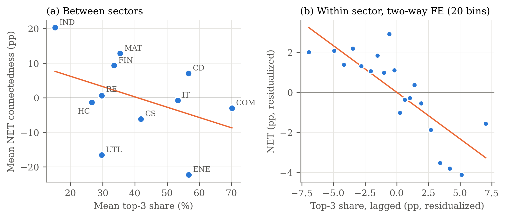

# Concentrated Sectors Transmit Less

**Within-Sector Concentration and Time-Varying Connectedness in the S&P 500, 2018 to 2026**

**Author:** Tanishk Yadav, NYU Tandon School of Engineering\
**Status:** SSRN preprint [6475898](https://papers.ssrn.com/sol3/papers.cfm?abstract_id=6475898), revised September 2026 to this manuscript. Not peer reviewed.\
**Paper, figures and summary:** [tanishkyadav.me/research/concentrated-sectors](https://www.tanishkyadav.me/research/concentrated-sectors)\
**Manuscript:** [`paper/v2/manuscript.pdf`](paper/v2/manuscript.pdf)\
**Earlier version:** a 2019 to 2025 study first posted under the same SSRN ID; its retracted results are listed under [Previous version](#previous-version-and-what-was-retracted).



---

## Question

The ten largest firms rose from 24% to 41% of S&P 500 market capitalization between 2018 and 2025. Did that concentration change the way shocks travel between the eleven GICS sectors?

## Key results

| Result | Value |
|---|---|
| Sample | 1,989 trading days, 2018-10-01 to 2026-08-31 (after the 2018 Communication Services reorganization) |
| Static total connectedness, returns / range volatility | 79.5% / 77.7% |
| Filtered TVP-VAR total connectedness, peak | 88.9% (16 Mar 2020) |
| Filtered TVP-VAR total connectedness, sample low | 53.7% (Aug 2026) |
| Concentration effect on net connectedness (sector and month fixed effects, Driscoll-Kraay SEs) | +1 pt top-3 share: -0.47 pts (t = -3.6); -0.66 pts on uncapped constituent returns (t = -4.8) |
| Mechanism | Concentrated sectors co-move less with the rest of the market (granularity) |
| Granger links surviving FDR, heteroskedasticity-robust, full sample and both halves | 0 of 110 |
| Size of the classical Granger F-test at nominal 5% under GARCH errors (data-calibrated Monte Carlo) | 21% (fixed lag), 31% (min over lags) |
| Sectors with positive out-of-sample R² from lagged cross-sector returns | 0 of 11 |

Industrials and Materials are net transmitters on almost every day; Energy and Utilities are net receivers on every day.

## Abstract

This paper asks how rising concentration changed the way shocks travel between the eleven GICS sectors, using daily returns and range volatilities of the Select Sector SPDR funds from October 2018 to August 2026, a point-in-time constituent panel, and a filtered TVP-VAR connectedness model. Sector connectedness is contemporaneous: classical Granger tests appear to find 90 of 110 significant links, but they are oversized under GARCH errors, heteroskedasticity-robust tests leave none, and lagged cross-sector returns have negative out-of-sample R² for every sector. Total connectedness peaked at 88.9% in March 2020 and fell to a sample low of 53.7% in August 2026. With sector and month fixed effects, a one-point rise in a sector's top-three share lowers its net directional connectedness by 0.47 points (t = -3.6), and by 0.66 points on uncapped constituent returns. Concentrated sectors also co-move less with the rest of the market, consistent with granular firm-level shocks dominating their returns.

**Keywords:** connectedness, market concentration, TVP-VAR, Granger causality, heteroskedasticity-robust inference, granularity
**JEL:** C12, C23, C32, G12, L11

## Data

- **Sector returns:** the 11 Select Sector SPDR funds, daily log returns and Parkinson range volatility.
- **Point-in-time constituent panel:** historical S&P 500 membership (78 since-removed firms recovered), historical share counts on a split-consistent basis, the 2023 GICS reclassification, and dual-class share classes deduplicated. Used for within-sector concentration (top-1, top-3 share, HHI) and for uncapped constituent-built sector returns. The index top-10 share matches published figures within 1-3 points.
- **Why both:** the SPDR funds cap single-name weights, which mutes concentration exactly where it is highest; the constituent-built series is the robustness check.

## Methods

1. Static Diebold-Yilmaz (2012) connectedness on returns and range volatility, with a robustness grid over lag order, horizon, and series construction.
2. Filtered TVP-VAR connectedness (Antonakakis, Chatziantoniou and Gabauer 2020) with forgetting factors (Koop and Korobilis 2013): each date uses only data available on that date. A 200-day rolling window, by contrast, shows a spurious 20-point drop when the April 2025 tariff shock leaves the window.
3. Granger causality conditional on the full system with heteroskedasticity-robust Wald tests and Benjamini-Hochberg FDR, full sample and both halves; a Monte Carlo calibrated to the data measures the size of the classical test.
4. Out-of-sample predictability of next-day sector returns (Campbell-Thompson R², Clark-West test).
5. Panel regressions of monthly net connectedness on lagged within-sector concentration, two-way fixed effects, Driscoll-Kraay standard errors; robustness on uncapped returns, excluding the two most capped sectors, and between-sector means; a granularity mechanism test.

## Reproducing

```bash
python -m venv .venv && source .venv/bin/activate
pip install -r requirements.txt
python src/build_panel.py          # data/panel/: ETF returns and volatility, constituent returns, concentration
python src/econometrics.py         # connectedness, Granger, out-of-sample tests, panel regressions
python src/montecarlo_granger.py   # size of classical vs robust Granger tests under GARCH
python src/robust_panel.py         # panel robustness
python src/mechanism.py            # granularity check
python src/figures_v2.py           # paper/v2/fig/
```

Outputs land in `output/v2/` (`summary.json` holds the headline numbers above).

## Project structure

```
src/
  build_panel.py          daily panel and point-in-time concentration
  econometrics.py         connectedness, Granger, OOS predictability, panel regressions
  montecarlo_granger.py   Granger test size under GARCH errors
  robust_panel.py         panel robustness
  mechanism.py            granularity (co-movement) test
  figures_v2.py           manuscript figures
  analysis.py, connectedness.py, hhi_dynamics.py, build_sector_returns.py
                          earlier-version pipeline, kept for the record
data/                     reference files and the built panel
output/v2/                results for this study
paper/v2/                 manuscript and figures
paper/paper.tex, .pdf     earlier version (superseded)
```

## Previous version and what was retracted

An earlier version of this project, posted on SSRN as "S&P 500 Sector Dynamics: Return Connectedness, Market Concentration, and Structural Clustering (2019 to 2025)" (same abstract ID, replaced by the current manuscript in September 2026), reported results that did not survive closer testing. They are listed here so nobody relies on them:

- **"88 of 110 Granger links significant under FDR"**: an artifact. Classical F-tests are oversized under heteroskedastic (GARCH) errors, and selecting the minimum p-value over lags makes it worse. Every classical rejection came from February to June 2020. With robust tests, 0 of 110 survive.
- **"Total connectedness 78.6%, rolling 55% to 87% peak in June 2020"**: an earlier data vintage and a rolling-window start artifact. Use the filtered figures above.
- **Random-forest LOO-CV accuracy of 95.6%**: circular (the classifier re-predicted the same clusters from the same features); it measures separability, not predictive validity.
- **The "overperformance index" and binomial market-structure labels**: dropped as unsupported.
- **An even earlier "297 significant Granger pairs" on quarterly data**: a multiple-testing artifact; none survive correction.

## License

MIT
